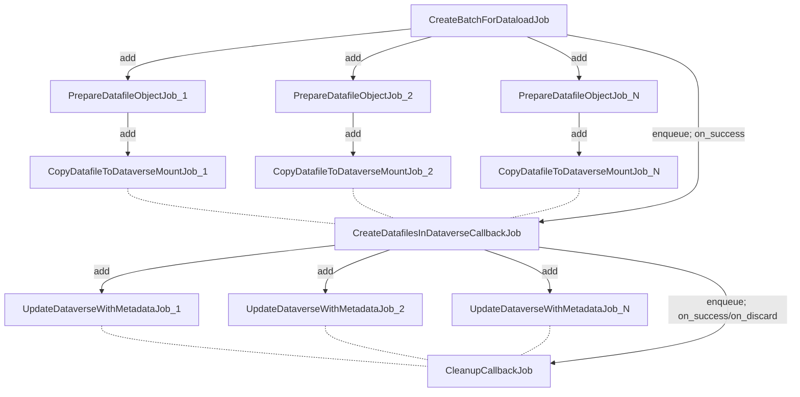
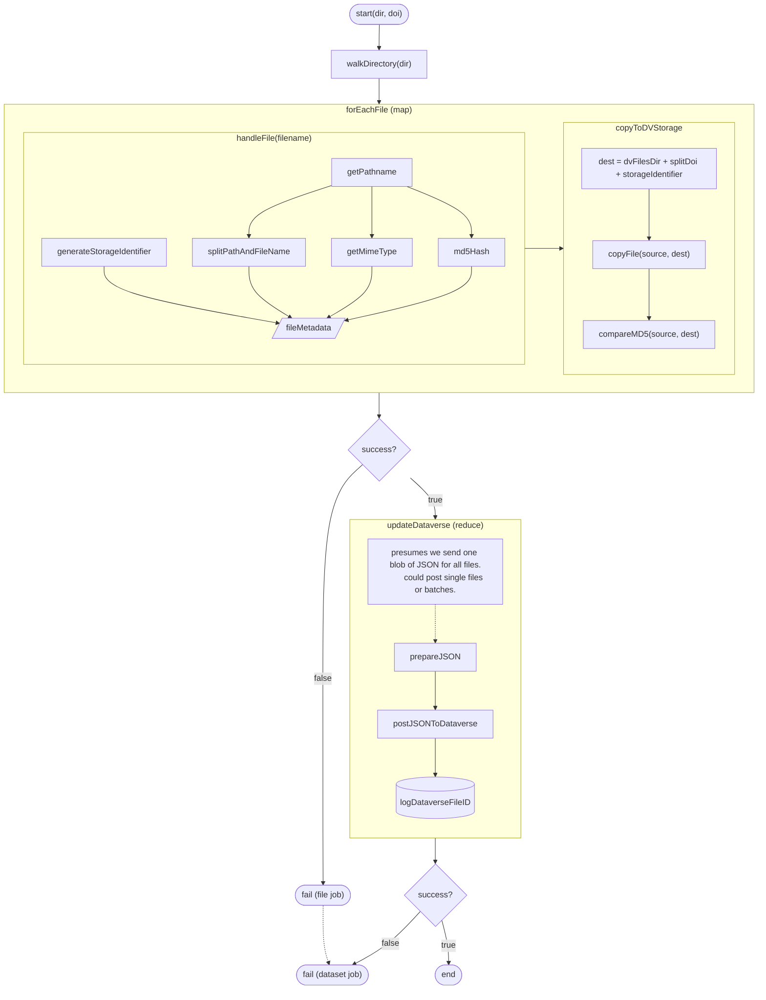

# job structure - questions and issues

* construction of a file object really depends on dataload/batch context. what's the best way to bring that in?
    * service object seems to be the way i'm leaning, but ... 
* what's the activejob/good_job idiom to get the right dependency sequence here? i.e., enumerate the files, build the datafile objects, run through 'em, etc.? 
    * the "complex batches" writeup in the good_job docs seems very confusing here 
* do we actually need the files in the database at all? (i think we do to materialize the batches to send them up to dataverse)

## updated

## original proposed job structure

